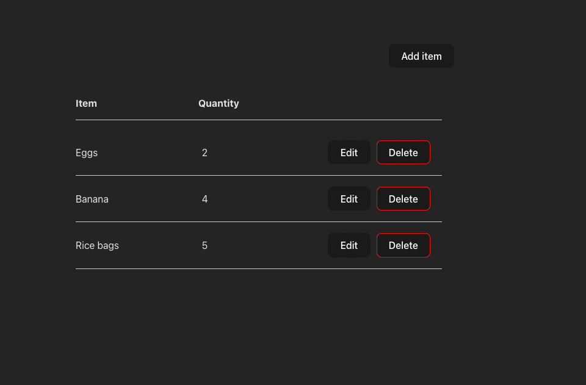

# FLNT Technical Test
***
This project consist of Vue3 composition api and option api in conjunction. For data persistance, localStorage has been used.

Clone the repo, then use the following terminal command to get started.
`yarn` then `yarn serve`

